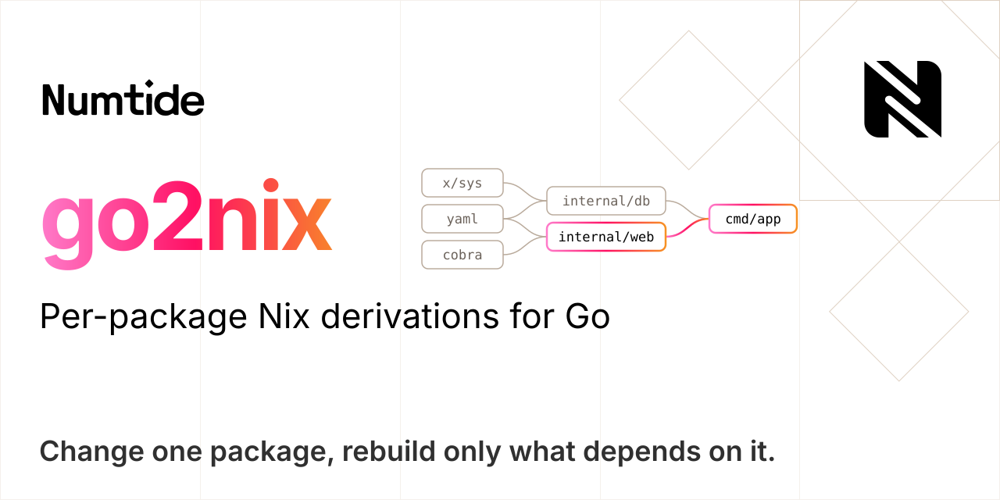

# go2nix

A Nix builder for Go that compiles every package in its own derivation, so a change rebuilds only the packages that depend on it.

[](LICENSE)
[](#about)
[](https://numtide.github.io/go2nix)
[](https://github.com/numtide/go2nix/actions/workflows/check-godebug-upstream.yml)
[](https://app.element.io/#/room/#home:numtide.com)

> **Experimental** — APIs and the lockfile format may change without notice.

## About

go2nix builds Go programs with Nix one package at a time. It pins *modules* (the versioned units in `go.mod`) in a small lockfile, asks `go list` for the graph of *packages* (the importable directories inside them), compiles every package — standard library, third-party, your own — in its own derivation with `go tool compile`, and links with `go tool link`. `go build` is never called.

It exists for repositories where building everything in one derivation throws away too much work: monorepos, services that share internal packages, anything where one edited file should not recompile four hundred untouched dependencies. Each package is a store path, so Nix caches, substitutes and shares it on its own, and the result is held to what `go build -trimpath` produces: same module info, same `GODEBUG` defaults, no build paths in the binary.

It is an alternative to nixpkgs' `buildGoModule` and to `gomod2nix`, which build the whole application in one derivation and remain the right choice when that is fast enough. go2nix costs more machinery — its default mode needs a Nix plugin at evaluation time — and pays it back when per-package reuse matters; the approach follows Bazel's `rules_go` with a much narrower scope. See [the comparison](#comparison-with-nix-alternatives).

## Features

- **One derivation per package.** Third-party packages are keyed on their module's source and their own dependencies, local packages on their own directory only, so touching `internal/web` rebuilds `internal/web` and what imports it, nothing else.
- **A lockfile of modules, not packages.** `go2nix.toml` holds one [NAR](https://nix.dev/manual/nix/latest/glossary#gloss-nar) hash per module and changes only when `go.mod` does; the package graph is discovered when Nix evaluates. Or no lockfile at all: hashes can be derived from `go.sum` and the module cache.
- **`go build` parity.** `-trimpath` rewrites, per-module `-lang`, `dep`/`=>` module info including filesystem `replace` targets, `DefaultGODEBUG` per toolchain and `go` directive, `GOFIPS140`, PGO, the platform's default build mode (PIE on darwin): `go version -m` on a go2nix binary reads like one from `go build -trimpath`.
- **Tests as part of the build.** `doCheck` compiles and runs the tests of every local package in the build, including test-only dependencies and helper packages, with `checkFlags` passed to the test binaries.
- **cgo without ceremony.** cgo packages are detected from `go list` and compiled with a C toolchain — C, C++ and Fortran sources, Go and gcc assembly — while pure-Go packages skip stdenv altogether; `packageOverrides` adds libraries per package or per module.
- **Monorepo-shaped.** `modRoot` builds one module inside a larger tree, sibling modules reached through `replace => ../dir` keep their own identity, and `srcFilter` lets a caller hand over the real tree plus a predicate instead of copying a filtered tree into the store first.
- **Early cutoff, if you want it.** With `contentAddressed = true` local packages become floating [content-addressed derivations](https://nix.dev/manual/nix/latest/development/experimental-features#xp-feature-ca-derivations) with a separate interface output, so a change that leaves a package's export data alone does not recompile its dependents.
- **Cross-compilation** the nixpkgs way: pass a cross `pkgs` and `GOOS`/`GOARCH` follow `stdenv.hostPlatform`.

## Installation

### Requirements

- Nix with flakes, on `x86_64-linux`, `aarch64-linux` or `aarch64-darwin`. The Go toolchain comes from nixpkgs; only `go2nix generate` needs a `go` on `PATH`, to download the modules it hashes.
- The default builder needs go2nix's Nix plugin loaded into the evaluator ([`plugin-files`](https://nix.dev/manual/nix/latest/command-ref/conf-file#conf-plugin-files)), and the plugin builds against Nix 2.34 or newer, the same Nix that loads it.
- Evaluation runs `go list`: `builtins.resolveGoPackages` executes on every evaluation, reads the Go module cache and may reach `GOPROXY`, so the project's modules must be downloadable or already in `GOMODCACHE` where Nix evaluates. `src` should be a path or an evaluation-time fetch, otherwise it is [import from derivation](https://nix.dev/manual/nix/latest/language/import-from-derivation).
- Optional: `contentAddressed = true` needs [`ca-derivations`](https://nix.dev/manual/nix/latest/development/experimental-features#xp-feature-ca-derivations); the experimental builder needs that plus [`recursive-nix`](https://nix.dev/manual/nix/latest/development/experimental-features#xp-feature-recursive-nix) and [`dynamic-derivations`](https://nix.dev/manual/nix/latest/development/experimental-features#xp-feature-dynamic-derivations).

### Flake input

go2nix is a flake. Add it as an input and build a toolchain scope with `lib.mkGoEnv`; there is no overlay, the scope is the API.

```nix
{
  inputs = {
    nixpkgs.url = "github:nixos/nixpkgs/nixpkgs-unstable";
    go2nix = {
      url = "github:numtide/go2nix";
      inputs.nixpkgs.follows = "nixpkgs";
    };
  };
}
```

### The plugin

The default builder calls `builtins.resolveGoPackages`, which comes from a Nix plugin this flake builds (`packages.<system>.go2nix-nix-plugin`). The evaluator has to load it, either for one command:

```bash
nix build \
  --option plugin-files \
  "$(nix build --no-link --print-out-paths github:numtide/go2nix#go2nix-nix-plugin)/lib/nix/plugins/libgo2nix_plugin.so"
```

or permanently, with `plugin-files` in `nix.conf` (`nix.settings.plugin-files` on NixOS, from `inputs.go2nix.packages.${pkgs.system}.go2nix-nix-plugin`). Without it evaluation stops at `error: attribute 'resolveGoPackages' missing`. Nix's plugin ABI changes between releases, so the plugin must be built against the Nix that loads it; the package builds against `nixVersions.nix_2_34`. Details in [Nix Plugin](docs/src/nix-plugin.md).

The flake's `nixConfig` adds `nix-community.cachix.org` as a substituter. The CLI alone is `nix run github:numtide/go2nix -- generate .`.

## Quick start

A module with one dependency:

```go
// main.go, next to a go.mod with `module example.com/my-app` and `require github.com/fatih/color v1.18.0`
package main

import "github.com/fatih/color"

func main() {
	color.Green("hello from go2nix")
}
```

Pin its modules:

```bash
cd my-app
nix run github:numtide/go2nix -- generate .
```

```toml
# go2nix.toml — one NAR hash per module; regenerate when go.mod changes
[mod]
  "github.com/fatih/color@v1.18.0" = "sha256-pP5y72FSbi4j/BjyVq/XbAOFjzNjMxZt2R/lFFxGWvY="
  "github.com/mattn/go-colorable@v0.1.13" = "sha256-qb3Qbo0CELGRIzvw7NVM1g/aayaz4Tguppk9MD2/OI8="
  "github.com/mattn/go-isatty@v0.0.20" = "sha256-qhw9hWtU5wnyFyuMbKx+7RB8ckQaFQ8D+8GKPkN3HHQ="
  "golang.org/x/sys@v0.25.0" = "sha256-PXZ9EQZ7SFpcL7d3E1+KGTxziYlHEIZPfoXEbnaVD3I="
```

Describe the build in `flake.nix`, next to the inputs above:

```nix
  outputs = { nixpkgs, go2nix, ... }:
    let
      system = "x86_64-linux";
      pkgs = nixpkgs.legacyPackages.${system};
      goEnv = go2nix.lib.mkGoEnv {
        inherit (pkgs) go callPackage;
        go2nix = go2nix.packages.${system}.go2nix;
      };
    in
    {
      packages.${system}.default = goEnv.buildGoApplication {
        pname = "my-app";
        version = "0.1.0";
        src = ./.;
        goLock = ./go2nix.toml;
      };
    };
```

Build it with the plugin loaded (see [Installation](#installation)) and run `./result/bin/my-app`. What Nix built: the standard library (`go-stdlib-…`), one fetch per module (four `gomod-…`), one compile per package `main.go` reaches (`gopkg-github.com-fatih-color-v1.18.0`, `gopkg-github.com-mattn-go-colorable-v0.1.13`, `gopkg-github.com-mattn-go-isatty-v0.0.20`, `gopkg-golang.org-x-sys-unix-v0.25.0` — one package of `x/sys`, not the module — and `golocal-example.com-my-app`), an importcfg bundle (`my-app-deps-importcfg`), and the link. Edit `main.go` and build again: only `golocal-example.com-my-app` and the link change.

## Usage

Everything hangs off the scope `mkGoEnv` returns. The full attribute tables are in [Builder API](docs/src/builder-api.md); this is the map.

### `lib.mkGoEnv`

```nix
goEnv = go2nix.lib.mkGoEnv {
  inherit (pkgs) go callPackage;                 # toolchain and the package set to build in
  go2nix = go2nix.packages.${system}.go2nix;     # the CLI the builders run
  goEnv = { };                                   # env for the stdlib and every go tool call: GOEXPERIMENT, GOFIPS140, CGO_ENABLED
  netrcFile = null;                              # .netrc for private modules (ends up in the store — use a scoped token)
  nixPackage = null;                             # a Nix with recursive-nix, only for the experimental builder
};
```

The scope holds `buildGoApplication`, `buildGoApplicationExperimental`, `go`, `go2nix`, `stdlib`, `hooks`, `fetchers.fetchGoModule` and `helpers`. It is a `lib.makeScope`, so `goEnv.overrideScope` replaces any of them — for instance to wrap `fetchGoModule` with a proxy's authentication. The standard library is compiled once per scope and shared by every build in it.

### `buildGoApplication`

```nix
goEnv.buildGoApplication {
  pname = "server";
  version = "1.4.0";
  src = ./.;                         # a path or an eval-time fetch; a derivation here means import-from-derivation
  goLock = ./go2nix.toml;            # omit for a lockfile-free build
  subPackages = [ "./cmd/server" ];  # default [ "." ]
  modRoot = ".";                     # where go.mod is, relative to src
  tags = [ "netgo" ];
  ldflags = [ "-s" "-w" "-X main.version=1.4.0" ];
  gcflags = [ ];
  CGO_ENABLED = null;                # null: per package, from its files
  pgoProfile = null;
  doCheck = true;
  checkFlags = [ ];
  packageOverrides = { };
}
```

- **`subPackages`** are the main packages to link, relative to `modRoot`; a missing `./` is added. Each becomes a binary in `$out/bin`, named after its directory (`pname` for `.`). Only packages reachable from them (plus, under `doCheck`, from their tests) are built.
- **`modRoot`** is for a module inside a larger tree: `src` is the repository root, `modRoot = "services/api"` is where `go.mod` lives. That is what lets `replace example.com/lib => ../../lib` resolve — the builder needs the sibling directory inside `src`. `"./services/api"` and `"services/api"` are the same.
- **Lockfile or not.** With `goLock`, module hashes come from `go2nix.toml` and the link step checks the lockfile against `go.mod`, failing on drift. Without it the plugin computes each module's hash from `go.sum` and `GOMODCACHE` while evaluating — nothing to regenerate, no reviewable pin file. Prefer the lockfile for anything you ship.
- **`doCheck`** (default `true`, as in `buildGoModule`) runs the tests of the local packages in the build. Test-only third-party packages and local helper packages imported only from `_test.go` files get their own derivations. Tests see a filtered copy of `src`: Go files, resolved `//go:embed` targets and `testdata/`; add other runtime files with `extraMainSrcFiles`. See [Test Support](docs/src/test-support.md).
- **`packageOverrides`**, keyed by import path or, as a fallback, module path: `nativeBuildInputs` (cgo packages only), `env`, `srcOverlay`. See [Package Overrides](docs/src/package-overrides.md).
- **`srcFilter`** is a `path: type: bool` ANDed into every filtered copy the builder makes of `src`, so `src` can stay the real tree.
- **`contentAddressed`** needs the `ca-derivations` experimental feature; see [Incremental Builds](docs/src/incremental-builds.md).
- Also: `goProxy`, `allowGoReference`, `nativeBuildInputs`, `meta`, `passthru`. The result's `passthru` exposes `packages`, `localPackages`, `depsImportcfg`, `mainSrc`, `modulePath` and, with `doCheck`, `testPackages`.

### `-trimpath`

go2nix always builds the way `go build -trimpath` does. File names in stack traces and `runtime.Caller` match a vanilla `-trimpath` build, and a path that escapes the rewrite fails the build instead of reaching the binary.

<details>
<summary>How the rewrite is done</summary>

Each compile passes `-trimpath` with two rewrites: the package's source directory becomes its import path for main-module packages, or `<module>@<version>/<subdir>` for third-party packages and for sibling modules behind a filesystem `replace` (the version from the `require` line), and the build's temporary directory becomes nothing. The standard library is installed with `--trimpath`, the recorded build settings say `-trimpath=true`, and the final derivation lists its filtered source tree — and the Go toolchain, unless `allowGoReference = true` — in `disallowedReferences`, so a path that escaped the rewrite fails the build instead of dragging the source into the binary's closure.

</details>

### The resolver contract

`builtins.resolveGoPackages` is what the default builder is written against. It is impure by nature (it runs a program and reads the module cache) and runs once per evaluation. You normally never call it yourself.

<details>
<summary>Inputs and the fields it returns</summary>

It takes `{ src, modRoot ? ".", subPackages ? [ "." ], tags ? [ ], goos, goarch, cgoEnabled, goProxy, doCheck ? false, resolveHashes ? false, go ? <the toolchain baked into the plugin> }`, runs `go list -deps -json` (and a second `-test` pass under `doCheck`) with `GOFLAGS=-mod=readonly`, `GOWORK=off`, `GOENV=off` and the caller's `GOMODCACHE`, `GOPROXY` and `NETRC`, and returns:

| Field | Content |
|---|---|
| `packages`, `testPackages` | third-party packages by import path: `modKey` (`path@version`), `subdir`, `imports` (third-party only), `drvName`, file lists, cgo flags |
| `localPackages`, `testLocalPackages` | main-module and filesystem-replaced packages: `dir` (relative to `src`), `modPath`, `localImports`, `thirdPartyImports`, file lists, `mainSrcFiles` |
| `modulePath`, `goVersion` | the main module's path and `go` directive |
| `replacements` | `replace` directives with a version, by `modKey` |
| `siblingModules`, `localReplaceDirs`, `nestedModuleRoots` | filesystem `replace` targets: identity per module, their directories, every directory holding a `go.mod` |
| `subPackageClosures` | per main package: the modules it links (for module info) and whether it needs a C++ linker |
| `moduleHashes` | with `resolveHashes`: NAR hash per module, for lockfile-free builds |
| `apiLevel` | the contract's version; `builtins.go2nixApiLevel` reports the plugin's, and the builder warns when they differ |

</details>

### `buildGoApplicationExperimental`

The same per-package build, with the graph discovered at build time inside a recursive-nix derivation instead of at evaluation time: no plugin, but it needs `nixPackage` in `mkGoEnv`, a lockfile, and Nix ≥ 2.34 with `recursive-nix`, `ca-derivations` and `dynamic-derivations`. It ignores `version`, `doCheck` and the other default-only attributes, and the binary is the result's `.target`. See [Experimental Mode](docs/src/modes/experimental-mode.md).

### The `go2nix` CLI

`go2nix generate [dir]` writes `go2nix.toml` (also what bare `go2nix` does) and `go2nix check` validates one against `go.mod`. `compile-package`, `link-binary`, `test-packages` and `resolve` are what the derivations run; `list-packages`, `list-files`, `build-modinfo` and `generate-test-main` are standalone tools for looking at what the builders would see. See [CLI Reference](docs/src/cli-reference.md).

## Documentation

The manual is an mdBook under `docs/src`, published at <https://numtide.github.io/go2nix>:

- Using it: [Builder API](docs/src/builder-api.md) (every attribute of both builders and of `mkGoEnv`), [Package Overrides](docs/src/package-overrides.md), [Test Support](docs/src/test-support.md), [Lockfile Format](docs/src/lockfile-format.md) (and lockfile-free builds), [Troubleshooting](docs/src/troubleshooting.md).
- Understanding it: [Builder Modes](docs/src/modes/README.md) ([default](docs/src/modes/default-mode.md), [experimental](docs/src/modes/experimental-mode.md)), [Nix Plugin](docs/src/nix-plugin.md), [Incremental Builds](docs/src/incremental-builds.md), [Architecture](docs/src/go2nix-architecture.md).
- Working on it: [CLI Reference](docs/src/cli-reference.md), [Benchmarking](docs/src/benchmarking.md).

## How it works


Every box is a derivation and every arrow an input. The stages, in the order they happen:

1. **Resolve.** While Nix evaluates, the plugin runs `go list` over `src` and hands back the package graph: a Rust core that classifies packages as third-party (fetched modules) or local (the main module and filesystem `replace` targets), and a C++ shim that registers the primop. Build tags, `GOOS`/`GOARCH` and `CGO_ENABLED` are the build's, so the file lists match what will be compiled.
1. **Fetch.** Every module is a [fixed-output derivation](https://nix.dev/manual/nix/latest/glossary#gloss-fixed-output-derivation) that runs `go mod download` and keeps only the extracted source tree, so its hash does not depend on which proxy served it. `replace` directives with a version change where a module is fetched from, not what it is called.
1. **Compile.** The builder maps the graph to derivations. A third-party package depends on its module's source and on the packages it imports; a local package gets a copy of only its own directory (nested packages and nested modules excluded), so editing a neighbour does not change its input. Pure-Go packages are compiled by a bare `derivation` that runs `go2nix compile-package` — no stdenv, no phases; cgo packages go through stdenv for the C compiler wrapper. Each compile reads an [importcfg](https://pkg.go.dev/cmd/compile#hdr-Command_Line) (the file that tells the compiler where each imported package's archive is) made of the standard library's and its dependencies' entries.
1. **Link.** One small derivation concatenates every package's importcfg entry, so the final derivation depends on a bundle instead of on hundreds of packages. `go2nix link-binary` checks the lockfile, generates the module info `go build` would embed, compiles the main packages and runs `go tool link`.
1. **Test.** Under `doCheck` the same derivation then runs `go2nix test-packages`: it generates the test mains, compiles internal and external test packages against the already-built archives, and runs them.

More in [Architecture](docs/src/go2nix-architecture.md), [Default Mode](docs/src/modes/default-mode.md) and [Incremental Builds](docs/src/incremental-builds.md), which has numbers for what a change rebuilds and what evaluation costs.

## Comparison with Nix alternatives

| Tool | Model | Best at | Compared with go2nix |
|---|---|---|---|
| `buildGoModule` | one vendor fetch, one build derivation | standard nixpkgs packaging, least to learn | coarser caching; Nix does not see the package graph |
| `gomod2nix` | lockfile of modules, `go build` in one derivation | offline, reproducible application builds with a mature workflow | per-module fetches, application-level build |
| `gobuild.nix` | per-module derivations over `GOCACHEPROG` | incremental module builds, package-set composition | granularity is the module and Go's cache, not the package |
| `nix-gocacheprog` | Go's own cache shared through a host daemon | fast local iteration on one machine | deliberately impure; an optimisation, not a builder |
| `go2nix` | package graph, `go tool compile`/`link` per package | fine-grained caching and explicit rebuilds | more moving parts; the default mode needs the plugin |

## Development

```bash
git clone https://github.com/numtide/go2nix && cd go2nix
nix develop                                         # or: direnv allow — Go 1.26, golangci-lint, mdbook, hyperfine

(cd go/go2nix && go test ./...)                     # CLI unit tests
nix build .#go2nix-nix-plugin                       # the plugin; its build runs the resolver's unit tests
nix build .#test-fixture-testify-basic              # one integration fixture (needs recursive-nix)
nix flake check                                     # formatting, linters, clippy, plugin eval tests, godebug table
nix fmt                                             # treefmt: nixfmt, deadnix, statix, gofumpt, shfmt, mdformat, ruff
nix run .#bench-incremental -- -fixture light       # what an edit rebuilds, measured
```

The integration fixtures under `tests/fixtures/` each have a `packages/test-fixture-*` derivation that loads the freshly built plugin into Nix 2.34 and builds the fixture inside the sandbox with recursive-nix; add one when fixing a build bug. `go/go2nix/pkg/buildinfo/godebug.go` mirrors the Go toolchain's table of `GODEBUG` settings, which is what makes `DefaultGODEBUG` come out right for every `go` directive; `go run scripts/check-godebug-table.go` compares it with the toolchain on `PATH` and `--update` rewrites it. A weekly workflow runs the check against the latest stable Go and opens an issue when a release changes the table. The documentation is an mdBook under `docs/`, published at <https://numtide.github.io/go2nix>. See [Benchmarking](docs/src/benchmarking.md) for the benchmark harness.

```
go/go2nix/    the CLI: lockfile generation, compile, link, test runner, module info
nix/          the builders: dag/ (default), dynamic/ (experimental), stdlib, scope
packages/     flake packages: the CLI, the Nix plugin (Rust core + C++ shim), tests, benchmarks
tests/        fixtures and Nix-level tests
docs/         the mdBook
```

## Contributing

Issues and pull requests are welcome. CI is numtide's buildbot on every pull request, plus a benchmark regression job on GitHub Actions; `main` merges through a merge queue. The fixtures are flake packages, not checks, so `nix flake check` does not run them: build the ones your change touches (`nix build .#test-fixture-<name>`). Branches use a type prefix (`feat/`, `fix/`, `docs/`). A change to what the resolver returns has to keep `nix/dag` and the plugin compatible in both directions or bump the API level in both. A change to build behaviour should say what `go build` does in the same situation — parity with cmd/go is the specification.

## Acknowledgments

- The Go toolchain: go2nix drives `go list`, `go tool compile`, `go tool link` and friends directly and follows cmd/go's behaviour wherever the two could differ.
- [rules_go](https://github.com/bazel-contrib/rules_go) for the model of building Go from an explicit package graph.
- [`buildGoModule`](https://nixos.org/manual/nixpkgs/stable/#sec-language-go) and [gomod2nix](https://github.com/nix-community/gomod2nix), which established how Go is packaged with Nix — vendor hashes, a lockfile of module hashes — and [gobuild.nix](https://github.com/adisbladis/gobuild.nix) and [nix-gocacheprog](https://github.com/dnr/nix-gocacheprog), which explore finer-grained reuse from other directions.

go2nix is a [numtide](https://numtide.com) project. Looking for help with Nix or with this project? <https://numtide.com/contact>

## License

[MIT](LICENSE)
