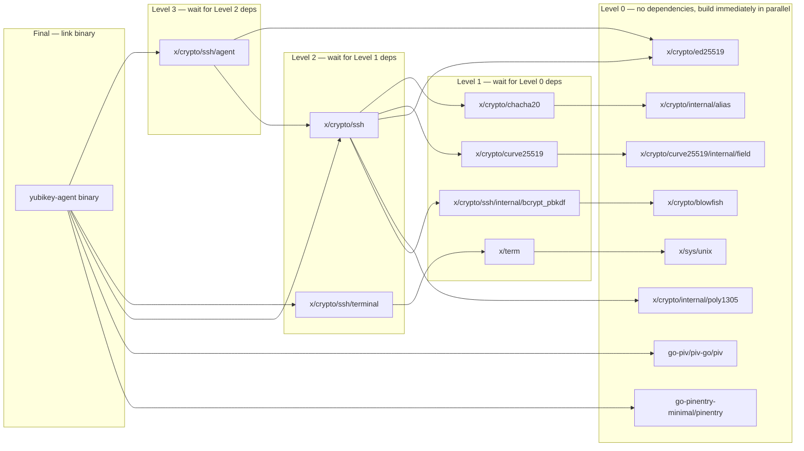
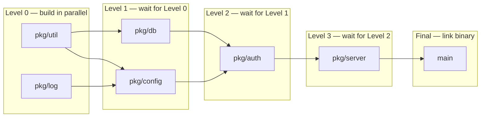

# go2nix Architecture

Technical reference for the go2nix build system — a package-level Go builder
for Nix that replaces `go build` with direct `go tool compile`/`asm`/`link`
invocations.

## Table of contents

- [Project overview](#project-overview)
- [Design goals](#design-goals)
- [The lockfile](#the-lockfile)
  - [Format (v2)](#format-v2)
  - [Composite keys](#composite-keys)
  - [The tidiness invariant](#the-tidiness-invariant)
  - [Monorepo sharing](#monorepo-sharing)
- [The Go CLI](#the-go-cli)
  - [generate](#generate)
  - [list-files](#list-files)
  - [list-packages](#list-packages)
  - [compile-package](#compile-package)
  - [compile-packages](#compile-packages)
  - [check](#check)
- [The Nix builder](#the-nix-builder)
  - [Entry point: mk-go-env.nix](#entry-point-mk-go-envnix)
  - [Package scope: scope.nix](#package-scope-scopenix)
  - [Standard library: stdlib.nix](#standard-library-stdlibnix)
  - [Module fetching: fetch-go-module.nix](#module-fetching-fetch-go-modulenix)
  - [Application build: build-go-application.nix](#application-build-build-go-applicationnix)
  - [Setup hooks](#setup-hooks)
  - [Helpers](#helpers)
- [Compilation pipeline](#compilation-pipeline)
  - [Third-party packages](#third-party-packages)
  - [Local packages](#local-packages)
  - [Linking](#linking)
  - [Cgo](#cgo)
  - [Assembly](#assembly)
- [Package DAG and parallel compilation](#package-dag-and-parallel-compilation)
  - [Third-party DAG](#third-party-dag)
  - [How Nix schedules this](#how-nix-schedules-this)
  - [What the DAG provides](#what-the-dag-provides)
  - [Local package DAG](#local-package-dag)
  - [Without precise imports](#without-precise-imports)
- [Staleness detection](#staleness-detection)
- [Known limitations](#known-limitations)

## Project overview

go2nix builds Go applications in Nix by calling `go tool compile`, `go tool asm`,
and `go tool link` directly — bypassing `go build` entirely. This gives Nix
full control over the dependency graph at **package granularity**: each Go
package becomes its own Nix derivation, with dependencies expressed as
`buildInputs`.

The system has two components:

1. **A Go CLI** (`go2nix`) that generates lockfiles, discovers packages and
   files, compiles packages, and validates lockfile consistency.
1. **A Nix library** that reads the lockfile, fetches modules, creates
   per-package derivations, and links binaries.

## Design goals

**Package-level granularity.** Each third-party Go package is its own Nix
derivation. When a module has 50 packages but your project only imports 3,
only those 3 are compiled. When a dependency changes, only affected packages
rebuild.

**No `go build` at build time.** The Nix sandbox has no network access and no
GOMODCACHE. go2nix calls `go tool compile` and `go tool link` directly,
assembling the importcfg from Nix derivation outputs. This eliminates Go's
build cache, module resolution, and vendoring — Nix handles all of that.

**Staleness as a build failure.** The lockfile uses composite keys
(`module@version`) so a version mismatch between `go.mod` and the lockfile
is caught at eval time, not silently vendored.

**Monorepo support.** Multiple projects can share one lockfile. Each project's
build filters it to just that project's dependencies.

## The lockfile

### Format (v2)

Plain TOML with three sections:

```toml
# go2nix lockfile v2. Generated by go2nix. Do not edit.

[mod]
"golang.org/x/crypto@v0.4.0" = "sha256-OPSQQFtv0bg..."
"golang.org/x/sys@v0.3.0" = "sha256-NoPMXR09lMD4f..."

[replace]
"github.com/foo/bar@v2.0.0" = "github.com/fork/bar"

[pkg."golang.org/x/crypto@v0.4.0"]
"golang.org/x/crypto/blowfish" = []
"golang.org/x/crypto/chacha20" = ["golang.org/x/crypto/internal/alias"]
"golang.org/x/crypto/ssh" = ["golang.org/x/crypto/chacha20", "golang.org/x/crypto/curve25519"]

[pkg."golang.org/x/term@v0.3.0"]
"golang.org/x/term" = ["golang.org/x/sys/unix"]
```

**`[mod]`** — Flat `modKey = hash`. One entry per module+version. Keyed by
`path@version`. The version is encoded in the key (no separate field).

**`[replace]`** — Optional. Maps `modKey` to the actual fetch path when a
`replace` directive applies. Only remote replaces; local replaces are excluded.

**`[pkg."module@version"]`** — Packages grouped by their parent module. Each
entry maps an import path to its direct third-party imports (empty list if
none). Grouping by module eliminates the per-package `module` back-reference
from v1.

Keys are sorted (BurntSushi/toml sorts map keys). Output is byte-deterministic.

The v2 format eliminates redundancy from v1: `version` (derivable from key),
`num_pkgs` (unused by Nix), and the per-package `module` field. This reduces
yubikey-agent's lockfile from 65 to 33 lines (~50%).

#### v1 format (historical)

The original format used `[mod.*]` with nested tables (`version`, `hash`,
`num_pkgs`, `replaced`) and `[pkg.*]` with per-package `module` and `imports`
fields. Superseded by v2.

### Composite keys

The lockfile is keyed by `module_path@version` instead of bare `module_path`.
This has two consequences:

1. **Staleness becomes a build failure.** The Nix builder looks up
   `path@version` from `go.mod`. A mismatched version simply isn't found, and
   Nix errors out with a clear message naming the missing module.

1. **One lockfile for N projects.** Multiple versions of the same module can
   coexist. A monorepo with 10 Go projects can share one `go2nix.toml` at
   the root; each project's build filters it to just that project's requires.

### The tidiness invariant

The lockfile records versions from `go list -json -deps`, which are
MVS-resolved — the versions Go actually uses. The Nix builder reads versions
from `go.mod`'s `require` directive. These match **if `go.mod` is tidy**.

This is enforced at three levels:

**At generation time** (CLI): `go list -json` resolves versions via MVS.
The lockfile records these resolved versions. If `go.mod` is untidy, the
recorded version won't match what `go.mod` says, and `check` will
catch it.

**At eval time** (Nix): when the builder reads the lockfile, it constructs
package derivations from `[pkg]` entries. If a required package isn't in the
lockfile, the build fails.

**At build time** (`check` in configure phase): `mvscheck` constructs
a minimal GOMODCACHE from the vendor tree's `go.mod` files and runs
`go mod graph` with `GOPROXY=off`. A tidy `go.mod`'s require block is exactly
the set of MVS-selected versions, so a GOMODCACHE populated with `.mod` files
for exactly those versions is sufficient for the walk. An untidy `go.mod`
reaches a version not in the cache, and Go fails naming the missing module.

This uses **Go's own MVS implementation** (`go mod graph`), not a
reimplementation.

### Monorepo sharing

Because the `[pkg]` section maps import paths to modules, and each project
only references its own packages, one `go2nix.toml` at the repo root can
contain the union of all modules across all projects:

```
monorepo/
  go2nix.toml              # union of all dependencies
  service-a/
    go.mod                  # requires 60 modules
    default.nix             # goLock = ../go2nix.toml
  service-b/
    go.mod                  # requires 80 modules, 50 shared with service-a
    default.nix             # goLock = ../go2nix.toml
```

## The Go CLI

[`cmd/go2nix/main.go`](../go/go2nix/cmd/go2nix/main.go) — dispatches to
subcommands. Default command (no args) is `generate`.

Debug logging: set `GO2NIX_DEBUG=1`.

### generate

```
go2nix generate [-o go2nix.toml] [-j N] [dirs...]
```

Produces a `go2nix.toml` from one or more Go project directories.

1. Reads existing lockfile as a cache (reuses hashes for unchanged modules).
1. Runs `go list -json -deps ./...` in each directory. Filters out stdlib
   and local packages.
1. Deduplicates packages across all directories.
1. Extracts unique modules. For each new/changed module, downloads it to
   a temporary GOMODCACHE and computes a NAR hash (SHA256, base64).
   Hashing runs in parallel via `errgroup` bounded by `-j` (default:
   `runtime.NumCPU()`).
1. Collects per-package third-party imports.
1. Writes the lockfile.

Cache invalidation: a cached entry is reused only if both the key matches
and the recorded `replaced` value matches. A changed `replace` directive
forces re-hash.

Implementation: [`pkg/lockfilegen/generate.go`](../go/go2nix/pkg/lockfilegen/generate.go).
Dependencies: `go-nix/pkg/nar` for NAR hashing, `x/sync/errgroup` for
parallelism.

### list-files

```
go2nix list-files [-tags=...] <package-dir>
```

Lists Go source files in a package directory with build constraints resolved.
Outputs JSON with fields: `go_files`, `cgo_files`, `s_files`, `c_files`,
`cxx_files`, `h_files`, `embed_files`.

Resolves `//go:embed` patterns to concrete file paths, producing an `embedcfg`
suitable for `go tool compile -embedcfg`.

Implementation: [`pkg/gofiles/gofiles.go`](../go/go2nix/pkg/gofiles/gofiles.go).

### list-packages

```
go2nix list-packages [-tags=...] <module-root>
```

Discovers all local packages in a module. Returns a JSON array of packages in
**topological order** (dependencies before dependents). Each entry includes
`import_path`, `src_dir`, `local_deps` (intra-module dependencies), and the
file listing from `list-files`.

Handles local `replace` directives by including replaced module directories in
the package scan. Detects cycles and returns an error.

Implementation: [`pkg/localpkgs/localpkgs.go`](../go/go2nix/pkg/localpkgs/localpkgs.go).

### compile-package

```
go2nix compile-package --import-path PATH --src-dir DIR --output FILE \
    --import-cfg FILE [--tags TAGS] [--trim-path PATH] [--gc-flags FLAGS]
```

Compiles a single Go package to a `.a` archive. This is the core compilation
command, called by both Nix hooks.

The compiler dispatches based on file types:

| Files present | Dispatch |
|---------------------|------------------------------|
| `.go` only | `compileGo` — `go tool compile` |
| `.go` + `.s` | `compileWithAsm` — symabis → compile → assemble → pack |
| cgo files | `compileCgo` — cgo → gcc → compile → pack |

Implementation: [`pkg/compile/`](../go/go2nix/pkg/compile/) — split across
`compile.go` (dispatcher), `go.go` (pure Go), `asm.go` (assembly),
`cgo.go` (cgo pipeline), `util.go` (helpers).

### compile-packages

```
go2nix compile-packages --import-cfg FILE --out-dir DIR [--tags TAGS] \
    [--gc-flags FLAGS] [--trim-path PATH] <module-root>
```

Compiles all **library** packages (non-main) in a module with DAG-aware
parallel scheduling. Uses `errgroup.WithContext` + `SetLimit` with per-package
done channels so goroutines wait only for their direct dependencies.

Appends compiled package entries to the provided importcfg file so the
subsequent link step can find them.

Implementation: [`pkg/compile/local.go`](../go/go2nix/pkg/compile/local.go).

### check

```
go2nix check [--lockfile PATH] [dir]
```

Two modes:

- **With `--lockfile`**: Checks that every non-local-replaced module in
  `go.mod`'s require block has a matching `module@version` entry in the
  lockfile. Reports missing modules.
- **Without `--lockfile`**: Constructs a fake GOMODCACHE from `vendor/` and
  runs `go mod graph` to verify `go.mod` is tidy.

Implementation: [`pkg/mvscheck/mvscheck.go`](../go/go2nix/pkg/mvscheck/mvscheck.go).

## The Nix builder

### Entry point: mk-go-env.nix

```nix
goEnv = import ./nix/mk-go-env.nix {
  inherit go go2nix;
  inherit (pkgs) callPackage;
  tags = [ "nethttpomithttp2" ];  # optional build tags
};

goEnv.buildGoApplication {
  src = ./.;
  goLock = ./go2nix.toml;
  pname = "my-app";
  version = "0.1.0";
}
```

[`mk-go-env.nix`](../nix/mk-go-env.nix) creates a scope via
[`scope.nix`](../nix/scope.nix) containing: `go`, `go2nix`, `stdlib`,
`hooks`, `fetchers`, `helpers`, and `buildGoApplication`.

### Package scope: scope.nix

Uses `lib.makeScope newScope` to create a self-referential package set.
Everything within the scope shares the same Go version, build tags, and
go2nix binary.

### Standard library: stdlib.nix

A single derivation that compiles the entire Go standard library:

```
GODEBUG=installgoroot=all GOROOT=. go install -v --trimpath std
```

Output: `$out/<pkg>.a` for each stdlib package + `$out/importcfg` mapping
import paths to `.a` files. Shared by all builds using the same Go version.

### Module fetching: fetch-go-module.nix

Fixed-output derivation (FOD) that downloads a Go module via the Go module
proxy:

```
go mod download "path@version"
```

Content-addressed by the NAR hash recorded in the lockfile. The output is a
GOMODCACHE directory structure. Each unique `module@version` is fetched once
and cached by Nix.

### Application build: build-go-application.nix

The main build function. Parameters:

| Parameter | Description |
|-------------------|---------------------------------------------------|
| `src` | Source directory |
| `goLock` | Path to `go2nix.toml` |
| `pname` | Package/binary name |
| `version` | Version string |
| `subPackages` | List of sub-packages to build (default: `["."]`) |
| `ldflags` | Linker flags |
| `CGO_ENABLED` | Override cgo detection (optional) |
| `moduleDir` | Module directory within src (default: `"."`) |
| `packageOverrides`| Per-package overrides (e.g., cgo `nativeBuildInputs`) |
| `nativeBuildInputs` | Extra build inputs for the final binary |

The function:

1. Processes the lockfile into a `{ modules, packages }` structure. When
   `builtins.wasm` is available (Nix with the `wasm-builtin` experimental
   feature), lockfile processing runs as a Rust WASM plugin
   (`nix/go2nix-wasm.wasm`) for faster eval. Otherwise, falls back to
   pure-Nix processing (`nix/process-lockfile.nix`). Both paths produce
   identical output.
1. Fetches each module as a FOD (`fetchGoModule`).
1. Creates a **per-package derivation** for each `[pkg]` entry. Each
   derivation uses `goModuleHook` and takes its direct import dependencies as
   `buildInputs`. Dependencies are resolved lazily via Nix's thunk evaluation.
1. Applies `packageOverrides` per import path or module path (for cgo
   libraries that need `pkg-config`, `libfoo`, etc.).
1. Creates the final binary derivation using `goAppHook`, with all third-party
   package derivations as `buildInputs`.

### Setup hooks

Three shell scripts in [`nix/hooks/`](../nix/hooks/), wired via
`makeSetupHook`:

**`setup-go-env.sh`** — Sets `HOME`, `GOPROXY=off`, `GOSUMDB=off`,
`GONOSUMCHECK='*'`. Registered as a `preConfigureHook`.

**`compile-go-pkg.sh`** — Build phase for third-party packages. Assembles
an importcfg from stdlib + `buildInputs`, then calls
`go2nix compile-package`. Writes an importcfg entry for consumers.

**`link-go-binary.sh`** — Three-phase build for applications:

1. **Configure**: Validate lockfile (`go2nix check`), extract module
   path from `go.mod`, assemble importcfg from stdlib + all third-party deps.
1. **Build**: Compile local libraries (`go2nix compile-packages`), then for each
   sub-package: compile main package (`go2nix compile-package`) and link
   (`go tool link`). If cgo was detected (`.has_cgo` marker), uses external
   linker (`-extld $CC -linkmode external`).
1. **Install**: Copy binaries to `$out/bin`.

### Helpers

[`helpers.nix`](../nix/helpers.nix) — Pure Nix utility functions:

- `modKeyPath key version` — Strip `@version` suffix from a composite key.
  Uses `builtins.substring` (cheaper than regex since version is already known).
- `sanitizeName` — Replace `/` → `-`, `+` → `_` for derivation names.
- `removePrefix` — Substring after a known prefix.
- `escapeModPath` — Go module case-escaping (`A` → `!a`) matching
  `golang.org/x/mod/module.EscapePath()` for GOMODCACHE paths.

## Compilation pipeline

### Third-party packages

Each third-party package is a Nix derivation:

```
[module FOD] ──fetch──> GOMODCACHE dir
                            │
[dep pkg derivation] ──────>│
[dep pkg derivation] ──────>│──importcfg──> go2nix compile-package ──> $out/importpath.a
[stdlib derivation]  ──────>│                                          $out/importcfg
```

The `compile-go-pkg.sh` hook:

1. Concatenates `stdlib/importcfg` + all dependency `importcfg` files.
1. Calls `go2nix compile-package` with the package's import path and source dir.
1. Writes `$out/importcfg` with a single `packagefile` entry for consumers.

### Local packages

Local (same-module) packages are compiled inside the application derivation,
not as separate derivations. `compile-packages` handles this with DAG-aware
parallel scheduling — see [Local package DAG](#local-package-dag) for details.

### Linking

After local libraries and main packages are compiled:

```
go tool link -buildid=redacted -importcfg FILE [ldflags] -o bin/name main.a
```

If cgo was used (`.has_cgo` marker exists), the linker runs with
`-extld $CC -linkmode external` for external linking.

### Cgo

`compileCgo` implements the 5-step cgo pipeline (matching `cmd/go`'s approach):

1. **`go tool cgo`**: Parse `import "C"` preambles (extracted via `go/parser`
   with `ImportsOnly`), resolve `#cgo` directives and `pkg-config`, generate
   C wrappers and Go bindings.
1. **Compile C/C++/asm**: Invoke `$CC`/`$CXX` on generated and user C/C++
   files, and `.s` files (C compiler, not `go tool asm`, in cgo mode).
1. **Test link + dynimport**: Link a test binary to extract dynamic symbols.
   Writes `_cgo_import.go` with `//go:cgo_import_dynamic` directives.
1. **`go tool compile`**: Compile all Go sources (user + cgo-generated).
1. **`go tool pack`**: Embed `.o` object files and `_cgo_flags` into the
   `.a` archive.

### Assembly

`compileWithAsm` handles packages with `.s` files:

1. **Generate symabis**: `go tool asm -gensymabis` on all `.s` files.
1. **Compile Go**: `go tool compile -symabis symabis -asmhdr go_asm.h` —
   generates assembly header with Go type offsets.
1. **Assemble**: `go tool asm` on each `.s` file with platform-specific
   `-D` flags (GOOS, GOARCH, plus arch variants like GOAMD64, GOARM, etc.).
1. **Pack**: `go tool pack` to add `.o` files into the archive.

## Package DAG and parallel compilation

Each `[pkg]` entry in the lockfile becomes a Nix derivation. The `imports`
field defines edges: if package A imports package B, then B is a `buildInput`
of A. Nix builds derivations respecting these edges — a package only builds
after all its dependencies are done.

### Third-party DAG

Using yubikey-agent as a concrete example:



### How Nix schedules this

Nix's builder sees the derivation graph and schedules builds by dependency
order. All Level 0 packages have no `buildInputs` from other packages, so
Nix starts building all 8 of them **simultaneously** (up to `max-jobs`).

As each Level 0 package finishes, Level 1 packages that depend on it become
unblocked. For example, once `alias` finishes, `chacha20` can start — even
while `blowfish` or `sysunix` are still building.

```
Time →

  alias       ████░░░░░░░░░░░░░░░░░░░░
  field       █████░░░░░░░░░░░░░░░░░░░
  ed25519     ███░░░░░░░░░░░░░░░░░░░░░
  poly1305    ████░░░░░░░░░░░░░░░░░░░░
  blowfish    ██████░░░░░░░░░░░░░░░░░░
  sys/unix    ███░░░░░░░░░░░░░░░░░░░░░
  piv-go      ████████░░░░░░░░░░░░░░░░
  pinentry    █████░░░░░░░░░░░░░░░░░░░
                   ↓
  chacha20    ░░░░████░░░░░░░░░░░░░░░░
  curve25519  ░░░░░████░░░░░░░░░░░░░░░
  bcrypt      ░░░░░░█████░░░░░░░░░░░░░
  term        ░░░░████░░░░░░░░░░░░░░░░
                        ↓
  ssh         ░░░░░░░░░░██████░░░░░░░░
  terminal    ░░░░░░░░████░░░░░░░░░░░░
                              ↓
  ssh/agent   ░░░░░░░░░░░░░░░░████░░░░
                                  ↓
  binary      ░░░░░░░░░░░░░░░░░░░░████  (link)
```

### What the DAG provides

**Correctness**: `compile-go-pkg.sh` builds each package's `importcfg` from
its `buildInputs`. Package `ssh` gets `packagefile` entries for `chacha20`,
`curve25519`, `ed25519`, `poly1305`, and `bcrypt` — exactly what `go tool
compile` needs to resolve its imports.

**Parallelism**: independent packages build simultaneously. Without the DAG,
Nix wouldn't know what depends on what.

**Incremental rebuilds**: if `alias` changes (e.g., module version bump),
only `alias` → `chacha20` → `ssh` → `ssh/agent` rebuild. The other 11
packages are cached. Without precise edges, a change to any package would
invalidate everything.

### Local package DAG

The Nix-level DAG handles **third-party** packages (each is a derivation). **Local**
packages (the main module's own library packages) are compiled within a single
derivation by `CompileLocalPackages` in `go/go2nix/pkg/compile/local.go`.

It uses the same DAG principle but at the Go process level:

1. `localpkgs.ListLocalPackages` discovers all local packages and their `LocalDeps`
2. A `done` channel map tracks completion of each package
3. An `errgroup` with `maxWorkers` (respecting `NIX_BUILD_CORES`) launches all
   packages concurrently — each goroutine waits on its local deps' channels
   before compiling
4. `importcfg` is pre-populated with all local package entries upfront; since DAG
   order is respected, each `.a` file exists by the time a dependent needs it



Both third-party and local packages benefit from parallel, DAG-aware
compilation — third-party via Nix's scheduler, local via Go's errgroup.

### Without precise imports

If every package depended on every other package:
- No parallelism — circular dependency makes this impossible in Nix
- All packages rebuild on any change

If all packages depended on nothing (importcfg empty):
- `go tool compile` fails — can't find imported packages

If dependencies were per-module (all packages in module X depend on all
packages in module Y):
- Coarser but valid DAG — still enables some parallelism
- A change in `x/sys` rebuilds ALL `x/crypto` packages, not just `term`
- Derivable from `go.mod` alone — no need to read third-party source

## Staleness detection

Three layers ensure the lockfile matches `go.mod`:

| When | What | How |
|------|------|-----|
| Generation | MVS consistency | `go list -json -deps` resolves actual versions |
| Nix eval | Missing packages | Package not in `[pkg]` → derivation doesn't exist |
| Build time | Lockfile consistency | `go2nix check --lockfile` verifies every `go.mod` require has a matching lockfile entry |
| Build time | Tidiness | `go2nix check` (no `--lockfile`) runs `go mod graph` against a GOMODCACHE built from vendor tree |

## Known limitations

- **No `go.work` support**: the CLI takes project directories, not a workspace
  file.

- **No test compilation**: `go2nix compile-package` does not compile `_test.go`
  files or build test binaries.

- **Version-qualified replaces** (`replace foo v1.0.0 => bar v2.0.0`): the
  `go.mod` parser keys by `"foo v1.0.0"` (path + old-version), but the
  check only looks up by bare path. Uncommon in practice.

- **Local packages are not derivations**: Local (same-module) packages are
  compiled inside the application derivation, not as separate cacheable
  derivations. A change to any local package recompiles all local packages.
