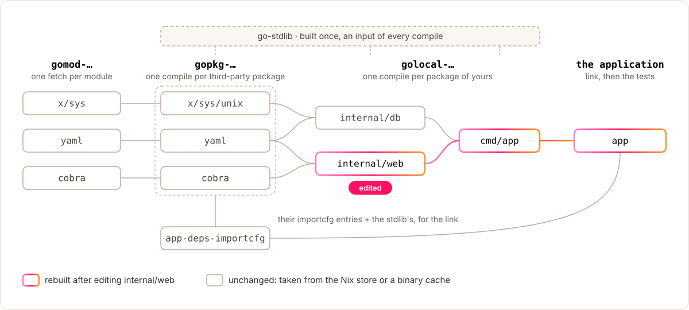

# Introduction

> **⚠️ Experimental** — APIs and lockfile formats may change without notice.

go2nix is a Nix-native Go builder with per-package derivations and
fine-grained caching. It is an alternative to nixpkgs `buildGoModule` for
projects that want more visibility and reuse than the usual "fetch all
modules, then build everything in one derivation" model.

In Go, a *module* is the versioned unit you depend on (one `go.mod`, one
entry in `go.sum`); a *package* is a single importable directory of `.go`
files. One module typically contains many packages. go2nix locks modules but
builds packages:

- the lockfile pins **modules**, not the package graph
- the builder discovers the **package graph** and compiles it at package granularity
- Nix can cache and rebuild **individual Go packages**, not just the whole app

This works especially well for monorepos and multi-package repositories that
want to maximize Nix store reuse. When only part of the Go package graph
changes, go2nix reuses the rest of the graph instead of rebuilding the whole
application derivation.

Every box above is a derivation; [Incremental Builds](incremental-builds.md)
explains what each one is keyed on.

If you just want the simplest way to package a Go program in nixpkgs,
`buildGoModule` is still the default choice. go2nix is aimed at cases where
per-package reuse and explicit graph handling are worth the extra machinery.

## Quick start

> **Heads up:** the default builder requires the go2nix [Nix plugin](nix-plugin.md)
> to be loaded into your evaluator (Nix 2.34 or newer). Without it, `nix build`
> fails with `error: attribute 'resolveGoPackages' missing`.

[Getting Started](getting-started.md) goes from an empty directory to a built
binary, with the output of every step. In short:

1. `nix run github:numtide/go2nix -- generate .` writes `go2nix.toml`, one
   hash per module (optional: `goLock = null` derives them from `go.sum`).
1. `go2nix.lib.mkGoEnv { … }` in your flake gives you a scope, and
   `goEnv.buildGoApplication { src = ./.; goLock = ./go2nix.toml; pname = …; }`
   describes the application.
1. `nix build`, with the plugin loaded through `--option plugin-files` or
   `nix.conf`.

## Where to next

- [Getting Started](getting-started.md) — the first build, step by step
- [Architecture](go2nix-architecture.md) — how the builder works
- [Builder Modes](modes/README.md) — default vs experimental
- [Incremental Builds](incremental-builds.md) — what gets cached
- [Builder API](builder-api.md) — full attribute reference
- [Troubleshooting](troubleshooting.md) — when something doesn't work
