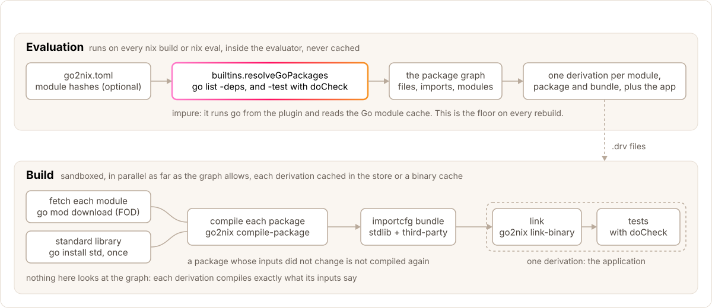

# Default Mode

Per-package Nix derivations at eval time, with fine-grained caching.

## Overview

The default mode creates per-package derivations from an eval-time package
graph. The go2nix-nix-plugin runs `builtins.resolveGoPackages` to discover
third-party packages, local packages, local replaces, module metadata, and
optional test-only packages when checks are enabled. Module hashes come from
the lockfile's `[mod]` section, or from the plugin itself when there is no
lockfile; `replace` directives that point at another module change where a
module is fetched from. When a single dependency changes, only it and its
reverse dependencies rebuild.



## Lockfile

The lockfile is optional. With one, module hashes are pinned in a file you
review and commit:

```bash
go2nix generate .
```

It contains only module hashes — the package graph is resolved at eval time
by the plugin, so it does not need to be regenerated when import
relationships change, only when modules are added, removed or bumped.

Without one (`goLock` left out or `null`), the plugin computes the hashes
from `go.sum` and the module cache while evaluating; see
[Lockfile-free builds](../lockfile-format.md#lockfile-free-builds).

## Nix evaluation flow

### 1. Module hashes (builtins.fromTOML, or the plugin)

With a lockfile, it is parsed at eval time with `builtins.fromTOML` and module
metadata (path, version, hash) is read from its `[mod]` section; that is the
only section the Nix side reads. Without one, the same table comes from the
plugin's `moduleHashes`.

### 2. Package graph discovery (builtins.resolveGoPackages)

The go2nix-nix-plugin runs `go list -json -deps` against the source tree at
eval time and returns the package graph (third-party, local, test-only, and
replacement metadata) — see [Nix Plugin](../nix-plugin.md#what-it-provides)
for the full return shape.

`replace` directives that point at another module come back as the plugin's
`replacements` and rewrite each module's `fetchPath` and `version`, so that
FODs download from the right place. Modules replaced with a directory are not
fetched at all: their packages are local packages.

### 3. Module fetching (fetch-go-module.nix)

Each module is a fixed-output derivation (FOD) that runs `go mod download` and
keeps only the extracted source tree: `$out` *is* the module's directory
(what would be `<escaped-path>@<version>/` in a module cache), without the
`cache/download` metadata, so the hash does not depend on which proxy served
it.

`GOPROXY` and `NETRC` are inherited from the builder's environment unless the
`goProxy` argument pins a proxy in the derivation; the `netrcFile` option
supports private module authentication.

### 4. Package derivations (default.nix)

For each third-party package in `goPackagesResult.packages`, a derivation is
created. `nix/dag` builds a JSON compile manifest for it (the importcfg
parts of its dependencies and of the standard library, build tags, gcflags,
the PGO profile, the package's file lists) and the derivation passes it to
`go2nix compile-package --manifest`.

Pure-Go packages — almost all of them — are a bare `builtins.derivation`
whose builder is bash running a short inline script: no stdenv, no phases,
just `go` and coreutils on `PATH`. CGO packages (where `pkg.isCgo` is true)
are a `stdenv.mkDerivation` using the `compile-go-pkg.sh` setup hook (from
`nix/dag/hooks/`), with `stdenv.cc` added to `nativeBuildInputs`.

Dependencies (`deps`) are resolved lazily via Nix's laziness — each package
references other packages from the same `packages` attrset.

### 5. Local package derivations

Each local package in `goPackagesResult.localPackages` (and, under `doCheck`,
`testLocalPackages`) also gets its own derivation. Its source is a copy of
that package's directory only — rooted at the directory itself, with nested
package directories and nested modules left out, and the caller's `srcFilter`
applied — so editing a neighbouring package does not change it. Local package
dependencies can point to other local packages and to third-party packages.
Packages of a module replaced with a directory compile with that module's own
`go` directive and `module@version`. With `contentAddressed = true` these are
the derivations that become content-addressed and gain an `iface` output.

### 6. Importcfg bundles

Instead of passing every compiled package as a direct dependency of the final
application derivation, the default mode builds bundled `importcfg` derivations:

- `depsImportcfg`: stdlib + third-party packages. Local packages are not in
  it; their archives reach the link through the link manifest, so a local
  edit leaves the bundle untouched
- `testDepsImportcfg`: adds test-only third-party packages when `doCheck = true`

This keeps the final derivation's input fan-in small while preserving
fine-grained package caching.

### 7. Application derivation

The final derivation receives typed JSON manifests via environment variables
and uses `goAppHook` (link-go-binary.sh) to invoke the Go CLI:

1. **Build phase** — writes `linkManifestJSON` to a file and calls
   `go2nix link-binary --manifest`, which validates the lockfile against
   `go.mod` (when there is a lockfile), generates modinfo, compiles main
   packages, and invokes the linker.
1. **Check phase** — writes `testManifestJSON` to a file and calls
   `go2nix test-packages --manifest`, which discovers testable local packages,
   compiles test archives, and runs them.

## Package overrides

Per-package customization (`nativeBuildInputs` for cgo packages, `env`,
`srcOverlay`) is supported via `packageOverrides` — see
[Package Overrides](../package-overrides.md) for lookup rules and recipes.

## Directory layout

```
nix/dag/
├── default.nix            # buildGoApplication
├── fetch-go-module.nix    # FOD fetcher
└── hooks/
    ├── default.nix        # Hook definitions
    ├── setup-go-env.sh    # GOPROXY=off, GOSUMDB=off
    ├── compile-go-pkg.sh  # Compile one cgo package (pure-Go ones skip stdenv)
    └── link-go-binary.sh  # Link binary and run checks
```

## Trade-offs

**Pros:**

- Fine-grained caching — changing one dependency doesn't rebuild everything
- No experimental Nix features required (`contentAddressed = true` is opt-in and needs `ca-derivations`)
- Small lockfile (module hashes only), or none at all
- Lockfile only changes when modules are added, removed or bumped, not when imports change
- Automatic CGO detection and compiler injection

**Cons:**

- Requires the go2nix-nix-plugin (provides `builtins.resolveGoPackages`), built against the Nix that evaluates (2.34 or newer)
- Many small derivations can slow Nix evaluation on very large projects

Compilation and linking are handled by the builder hooks and direct
`go tool compile` / `go tool link` invocations described above.
